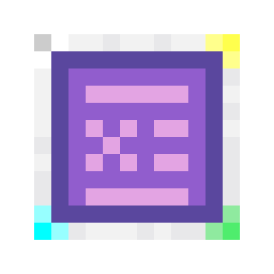

      

<h1 align="center">Extended Terminal</h1>

    
    
  

## Feature

- EMI/JEI support for experiences like the AE2's Crafting Terminal
- The Ultimate All-in-One: Crafting, Smithing, Stonecutting, and Anvil—All in a single terminal
- Go Beyond 3x3: Integrated support for extended crafting and custom grid sizes.
- You can add **Extended Terminal** to your modpack.

## Support Terminal

| Mod                                                                     | Version        | Wireless Terminal | Link                                                                                                                                         |
|-------------------------------------------------------------------------|----------------|---------------------------|----------------------------------------------------------------------------------------------------------------------------------------------|
| Extended Terminal                                                       | 1.21.1, 1.20.1         | ✔️                        | [CurseForge](https://www.curseforge.com/minecraft/mc-mods/extended-terminal), [Modrinth](https://modrinth.com/mod/extended-terminal)         |
| [Re:Avaritia](https://modrinth.com/mod/re-avaritia)                     | 1.21.1, 1.20.1 | ❌                         | [CurseForge](https://www.curseforge.com/minecraft/mc-mods/re-avaritia), [Modrinth](https://modrinth.com/mod/re-avaritia)                     |
| [AvaritiaNeo](https://www.curseforge.com/minecraft/mc-mods/avaritianeo) | 1.21.1, 1.20.1 | ❌                         | [CurseForge](https://www.curseforge.com/minecraft/mc-mods/avaritianeo), [Modrinth](https://www.curseforge.com/minecraft/mc-mods/avaritianeo) |                    
| [Extended Crafting](https://modrinth.com/mod/extended-crafting)         | 1.21.1, 1.20.1 | ❌                         | [CurseForge](https://www.curseforge.com/minecraft/mc-mods/extended-crafting), [Modrinth](https://modrinth.com/mod/extended-crafting)         |
| Extended Crafting: Expanded                                             | 1.20.1         | ❌                         | [CurseForge](https://www.curseforge.com/minecraft/mc-mods/extended-crafting-expanded)                                                        |

## Integrated My Mod:

| Mod | Version | fully support | Link |
|--------------------------------------------------------------------------------------------------------|--------------|--------------|----------------------------|
|[AE2 Tangible Bookmarks](https://modrinth.com/mod/ae2-tangible-bookmarks) | 1.21.1, 1.20.1 |✔️ | [CurseForge](), [Modrinth](https://modrinth.com/mod/ae2-tangible-bookmarks)|
|[AE2 Fluid Crafting Terminal](https://modrinth.com/mod/ae2-fluid-crafting-terminal) | 1.21.1 | ✔️       |[CurseForge](), [Modrinth](https://modrinth.com/mod/ae2-fluid-crafting-terminal)|

## License

- code: LGPL 3.0
- Assets
  -
  AE2: [See Details ](readme/ae2-license.md)

### Badges

